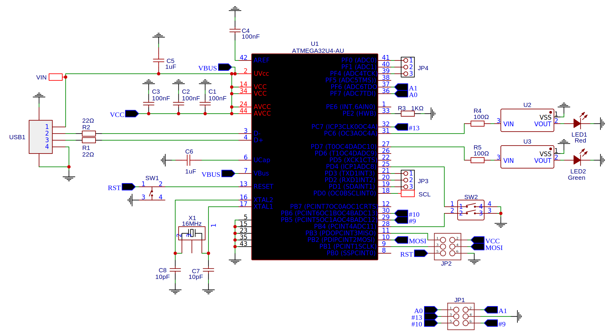

# Bad-USB

A bad-USB device based on an ATMEGA32U4.

## Usage

There is a template in `code\template`. This sets up the device and provides functions for using the virtual keyboard, only the payload itself needs to be added.

1. Choose a payload to upload
2. Turn the programming switch on then plug the bad-USB	in
3. Upload by using the Arduino IDE
4. Turn the programming switch off
5. Plug the device into the target computer

As this device uses an ATMEGA32U4 the bad-USB can be used as a normal Arduino with the built in GPIO pins.

## Hardware

- 2 LEDs
- 8 GPIO THT headers (JP1 and JP2)
- 8 GPIO SMD pads
- 2 switches
- A reset button

Circuit diagram:  

## PCB

Both versions of the PCB can be found in the `gerbers` folder.
